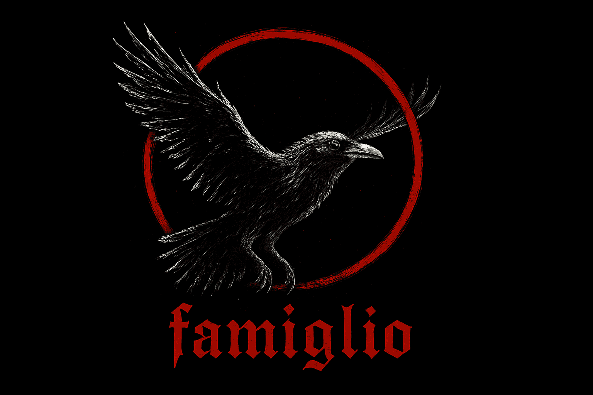

  

<h3 align="center">
  <strong>A loyal familiar watching over your code, silently weaving automation into your repositories.</strong>
</h3>

---

### 🧠 About

**Famiglio** is an open-source initiative to simplify and automate the release process of GitHub projects.  
It integrates with a custom **GitHub App** to handle versioning, changelogs, and publishing workflows — all from within your repositories.

Our goal is to make release management effortless, reliable, and fully traceable.

### 🚧 Status

Under active development — we’re currently building the core libraries and GitHub integration layer.

---

made with ❤️ and TypeScript

